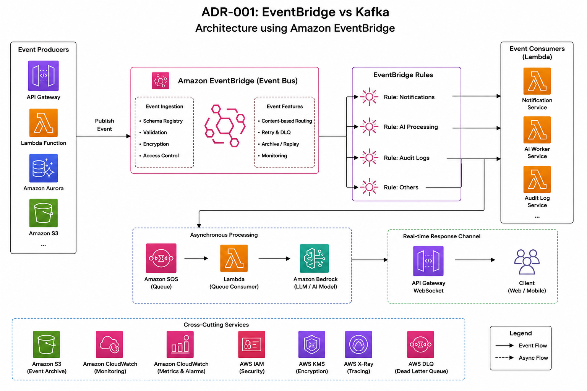

# ADR-001

# Choosing Amazon EventBridge over Apache Kafka

Status: Accepted

Date: 2026-07-07

---

# Problem Statement

The platform requires asynchronous communication between independently deployable services.

Typical events include:

- User registration
- AI processing requests
- Notification events
- Audit logging
- Report generation
- Workflow orchestration

The engineering team evaluated Amazon EventBridge and Apache Kafka as the event backbone.

---

# Context

The platform is built primarily on AWS using managed services.

Key requirements include:

- Loose coupling between services
- High availability
- Minimal operational overhead
- Native AWS integrations
- Easy event routing
- Secure cross-account communication
- Ability to onboard new consumers without modifying publishers

Expected event volume is measured in thousands of events per minute rather than millions per second.

The engineering team is relatively small, making operational simplicity an important consideration.

---

# Practical Experience

During an AWS migration initiative, we evaluated multiple approaches for implementing asynchronous communication between services responsible for AI processing, notifications, audit logging, and workflow orchestration.

While Apache Kafka offered greater throughput and fine-grained control over event streaming, our workloads consisted primarily of business events rather than continuous data streams. Since the platform was already using managed AWS services such as Lambda, SQS, API Gateway, and Step Functions, Amazon EventBridge provided a simpler operational model with native integrations and significantly lower maintenance overhead.

The decision reduced infrastructure management effort and enabled the engineering team to focus on delivering business capabilities instead of operating messaging infrastructure.

---

# Decision Drivers

The decision was evaluated using the following criteria.

| Driver | Importance |
|---------|------------|
| Operational simplicity | High |
| Reliability | High |
| Scalability | High |
| Cost | High |
| Native AWS Integration | High |
| Ordering Guarantees | Medium |
| Event Replay | Medium |
| Development Speed | High |
| Vendor Lock-in | Low |

---

# Options Considered

## Option A

Amazon EventBridge

---

## Option B

Apache Kafka (Amazon MSK)

---

# Decision

Amazon EventBridge will be used as the primary event routing platform.

Kafka remains a future option if platform requirements evolve toward high-volume event streaming or event sourcing.

---

# Rationale

The workload primarily consists of business events rather than continuous streaming data.

Examples include:

- UserCreated
- ReportGenerated
- PaymentCompleted
- AIRequestCreated
- NotificationRequested

These events are independent, short-lived, and consumed by multiple downstream services.

EventBridge provides:

- Fully managed infrastructure
- Automatic scaling
- Native integration with Lambda
- Direct integration with Step Functions
- Content-based routing
- Built-in retries
- Dead Letter Queue support
- Event archiving
- Cross-account event routing
- Schema Registry

These capabilities reduce operational complexity while satisfying current scalability requirements.

---

# Comparison

| Capability | EventBridge | Kafka |
|------------|-------------|--------|
| Infrastructure Management | None | Required |
| Scaling | Automatic | Manual Planning |
| Ordering | Limited | Excellent |
| Throughput | Moderate | Extremely High |
| Event Replay | Basic | Excellent |
| Event Retention | Limited | Configurable |
| Native AWS Integration | Excellent | Moderate |
| Operational Overhead | Very Low | High |
| Learning Curve | Low | High |
| Multi-account Support | Native | Additional Configuration |

---

# Why Kafka Was Not Selected

Kafka is an excellent platform for large-scale streaming systems.

However, the following capabilities were not immediate requirements:

- Multi-million events per second
- Long-term event retention
- Stream processing
- Event sourcing
- Analytics pipelines
- Exactly-once processing

Introducing Kafka would require:

- Broker management
- Capacity planning
- Consumer group tuning
- Partition strategy
- Monitoring infrastructure
- Upgrade planning

The additional operational complexity outweighed the benefits for the current workload.

---

# Trade-offs

## Benefits

- Faster implementation
- Reduced operational burden
- Lower infrastructure cost
- Better AWS integration
- Easier onboarding for development teams
- Simplified security using IAM

---

## Limitations

- Vendor lock-in
- Less control over event storage
- Limited replay capabilities
- No strict ordering guarantees
- Not suitable for analytics-scale streaming

---

# Risks

### Risk

Platform requirements may exceed EventBridge throughput.

Mitigation

Introduce Kafka selectively for streaming workloads while retaining EventBridge for business events.

---

### Risk

Vendor lock-in.

Mitigation

Keep event contracts independent of EventBridge-specific implementation details.

---

### Risk

Consumers becoming tightly coupled to event schemas.

Mitigation

Version events and maintain backward compatibility.

---

# Consequences

Positive

- Smaller operational footprint
- Reduced infrastructure management
- Faster development cycles
- Lower maintenance cost
- Improved developer productivity

Negative

- Event replay is less flexible
- Future migration may require event abstraction
- Certain analytics workloads may require Kafka later

---

# Architecture

---

# When NOT to Choose EventBridge

Avoid EventBridge if the system requires:

- Financial trading systems
- Clickstream analytics
- IoT telemetry ingestion
- Event sourcing
- Large-scale log aggregation
- Continuous streaming analytics
- Very low latency event processing

Kafka is generally the stronger choice in these scenarios.

---

# Lessons Learned

The objective of architectural design is not to choose the most powerful technology but to choose the technology that best satisfies current business requirements while keeping operational complexity manageable.

The team deliberately optimized for developer productivity and operational simplicity rather than maximum throughput.

Architecture decisions should be revisited as system scale and business requirements evolve.

---

# Future Considerations

If future requirements include:

- Event sourcing
- Data lake ingestion
- Stream analytics
- High-frequency telemetry
- Large-scale replay

Kafka should be re-evaluated.

---

# References

[AWS EventBridge Documentation
](https://docs.aws.amazon.com/eventbridge/)

[Apache Kafka Documentation
](https://kafka.apache.org/43/getting-started/introduction/)

[AWS Well-Architected Framework
](https://docs.aws.amazon.com/wellarchitected/latest/framework/welcome.html)
